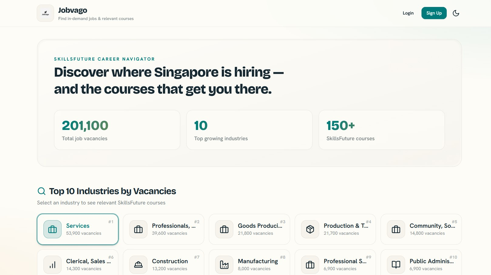
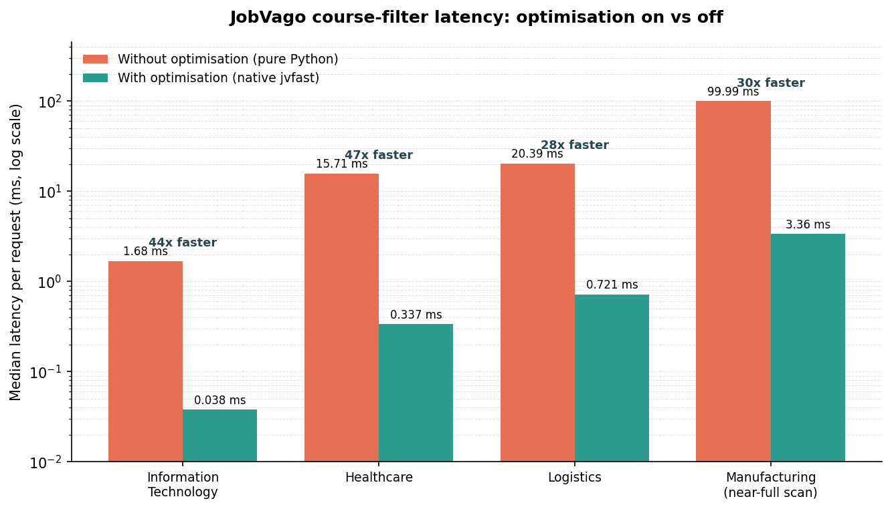

# SC2006 - Software Engineering

## Members
- Ho Sheng Wei
- Loh Gan Sui
- Ong Jee Shen
- Pan YiFan
- Wang QinYan

---

## JobVago

A career guidance web application that connects Singapore's job market data with SkillsFuture training courses. It helps users explore high-demand industries, discover subsidised courses, and improve their resumes with AI-assisted grading.

Built with Flask, SQLite, Tailwind CSS, and vanilla JavaScript. Data is sourced live from two Singapore government APIs.



---

## Demo video
[Demo video](https://youtu.be/rUHVzCvfcpk)

## Features

### Industry Dashboard
- Ranks the top 10 industries by job vacancy count using live quarterly data from [data.gov.sg](https://data.gov.sg)
- Displays vacancy counts, quarter-over-quarter growth rates, and industry icons
- Caches API data locally and auto-refreshes every 24 hours

### Course Discovery
- Matches SkillsFuture courses to industries via keyword analysis on course titles
- Each course card shows provider, duration, mode, rating, fees, subsidy percentage, impact badge, and auto-extracted skill tags
- Filter by impact level, mode, and language; sort by rating, price, or duration
- Click any course title to view learning outcomes and prerequisites in a detail modal
- Drill into a single industry (`/industry/<name>`) to see only its matched courses, with the same filters applied

### Resume Analysis
- Upload a PDF resume for a comprehensive grade out of 100 across three dimensions:
  - **Impact (0–40):** action verbs, quantified metrics, word repetition, filler words, leadership, extracurriculars
  - **Presentation (0–30):** page count, contact info, spelling
  - **Competencies (0–30):** analytical, communication, leadership, teamwork, initiative
- Subjective categories use DeepSeek AI (via Ollama) when available, with automatic fallback to rule-based scoring
- Each sub-category is labelled as AI-graded or rule-based
- Extracts skills from resume text and groups them by category (Programming, Cloud & DevOps, Data & AI, etc.)

### Resume Editor
- Extracts structured content from uploaded PDFs into an editable form
- Generates a new formatted PDF from the edited content

### Personalised Dashboard
- View favourited courses with language filtering
- Latest resume score summary with Impact / Presentation / Competencies breakdown
- Skills profile grouped by category
- Up to 6 course recommendations matched against extracted skills, ranked by match count and rating
- Browse a full history of past resume analyses on a dedicated page

### Authentication & Security
- Registration with input validation (email format, password ≥ 6 chars, name ≥ 2 chars, duplicate prevention)
- Email normalisation (lowercase + trim), password confirmation matching
- Passwords stored as hashed values using Werkzeug
- Session-based auth with remember-me support and redirect-after-login
- Route protection ensuring users can only access their own data
- HTTP-only, SameSite session cookies; secure cookies enforced in production

### Other
- Light and dark theme toggle (custom `jobvago` / `jobvago-dark` daisyUI themes), persisted in the browser with no flash on load
- Responsive layout

---

## Tech Stack

| Layer | Technology |
|-------|-----------|
| Backend | Python 3, Flask, Flask-Login, Flask-SQLAlchemy |
| Database | SQLite |
| Frontend | Jinja2 templates, Tailwind CSS v4 + daisyUI v5, vanilla JavaScript |
| PDF Processing | pdfplumber, pdfminer.six, pypdf, ReportLab |
| AI Integration | DeepSeek R1 via Ollama (optional, local) |
| Native Acceleration | C++ Aho-Corasick keyword matcher via pybind11 (optional) |
| Production Server | Waitress (WSGI) |
| Testing | pytest (278 tests) |
| Data Sources | data.gov.sg REST APIs |

---

## Project Structure

```
jobvago/
├── app/
│   ├── __init__.py                  # App factory, blueprint + DataService singleton wiring
│   ├── controllers/
│   │   ├── auth_controller.py       # Login, register, logout routes
│   │   ├── career_controller.py     # Public industry + course pages, industry detail
│   │   ├── dashboard_controller.py  # User dashboard, favourites, past analyses
│   │   └── resume_controller.py     # Upload, edit, analyse, download, delete
│   ├── models/
│   │   ├── career.py                # Industry, Course, DashboardStats
│   │   └── user.py                  # User, FavoriteCourse, ResumeAnalysis, UserSkill
│   ├── native/                      # Optional C++ acceleration
│   │   ├── jvfast.cpp               # Aho-Corasick matcher (pybind11)
│   │   └── build.py                 # Quick in-place compile helper
│   ├── services/
│   │   ├── _cache.py                # mtime-keyed cache for parsed data files
│   │   ├── _fast.py                 # Native matcher adapter + pure-Python fallback
│   │   ├── auth_service.py          # Registration + authentication logic
│   │   ├── course_service.py        # CSV/Excel parsing, filtering, sorting
│   │   ├── data_downloader.py       # API fetching + caching
│   │   ├── data_service.py          # Orchestrates industry + course data
│   │   ├── favorite_course_service.py
│   │   ├── industry_keywords.py     # Industry-to-keyword mapping
│   │   ├── industry_service.py      # CSV parsing, ranking, growth calc
│   │   ├── resume_analysis_service.py   # Action verb scoring (AI + fallback)
│   │   ├── resume_editor_service.py     # PDF extraction + generation
│   │   ├── resume_grading_service.py    # 14-subcategory grading system
│   │   └── skill_extraction_service.py  # Skill taxonomy + regex extraction
│   ├── templates/                   # Jinja2 HTML templates (auth, career, dashboard, resume)
│   └── static/
│       ├── css/app.css              # Compiled Tailwind output (committed)
│       ├── src/app.css              # Tailwind + daisyUI source stylesheet
│       └── icons/                   # Favicons + logo
├── tests/
│   ├── conftest.py                  # Fixtures (app, client, db, sample_user)
│   ├── controllers/                 # Route-level tests
│   ├── models/                      # Model unit tests
│   ├── services/                    # Service-layer tests
│   ├── test_basis_path.py           # McCabe basis-path tests
│   └── test_ec_bva_auth_controller.py   # Equivalence-class + boundary-value tests
├── bench/
│   └── gen_and_bench.py             # Synthetic-dataset CPU benchmark
├── config.py                        # Dev / prod config
├── run.py                           # Entry point (Waitress in prod, dev server otherwise)
├── setup.py                         # Portable build for the native extension
├── package.json                     # Tailwind/daisyUI build scripts
├── optimisations.md                 # Performance work write-up
└── requirements.txt
```

---

## Getting Started

### Prerequisites
- Python 3.10+
- (Optional) [Node.js](https://nodejs.org) — only needed to rebuild the CSS; a compiled `app/static/css/app.css` is already committed
- (Optional) A C++ compiler (g++/clang or MSVC) for the native acceleration extension
- (Optional) [Ollama](https://ollama.ai) with the `deepseek-r1` model for AI-enhanced resume grading

### Installation

```bash
git clone https://github.com/985shen/jobvago.git
cd jobvago
python -m venv venv
source venv/bin/activate  # Windows: venv\Scripts\activate
pip install -r requirements.txt
```

### Run

```bash
python run.py
```

The app starts at `http://127.0.0.1:5000`.

By default `run.py` serves the app with **Waitress** (a production-grade WSGI server, much faster than the Flask dev server — especially on Windows). To run the Flask development server instead, with auto-reload and the interactive debugger:

```bash
FLASK_ENV=development python run.py   # Windows: set FLASK_ENV=development && python run.py
```

On first load, the app fetches data from the government APIs and caches it locally. Subsequent loads use the cache until it's older than 24 hours.

### Optional: Rebuild the CSS

The styling is built with Tailwind CSS v4 and daisyUI v5. The compiled stylesheet is committed, so this step is only needed if you change the styles or templates:

```bash
npm install
npm run build     # one-off build
npm run watch     # rebuild on change during development
```

### Optional: Enable AI Grading

```bash
ollama pull deepseek-r1
ollama serve
```

The app auto-detects Ollama at `http://localhost:11434`. If unavailable, all grading falls back to rule-based analysis — no configuration needed.


### Optional: Native Acceleration

The course-filtering and résumé-grading keyword matching can run in a small C++ extension (`jvfast`, Aho-Corasick) for a large speedup on the per-request course filter. This step is **optional** — if you skip it, the app runs exactly the same on a pure-Python fallback, just slower on those paths.

To build it (after `pip install -r requirements.txt`):

- Quick (Mac/Linux, uses g++/clang): `python3 -m app.native.build`
- Portable (all platforms, incl. Windows/MSVC): `python setup.py build_ext --inplace`

On startup the app prints whether native acceleration is active. To confirm manually:

```bash
python3 -c "from app.services._fast import NATIVE_AVAILABLE; print(NATIVE_AVAILABLE)"
```

Behaviour is identical with or without the extension, and the full test suite passes either way. See [`optimisations.md`](jobvago2/optimisations.md) for the measured before/after numbers.



### Run Tests

```bash
python -m pytest tests/ -v
```

278 tests covering models, services, and controllers, including basis-path (McCabe) and equivalence-class / boundary-value test suites. A handful of data-dependent tests skip automatically when the cached `JobVacancies.csv` / `SkillsFutureCourses.xlsx` files aren't present locally.

---

## How the Resume Grading Works

The grading system scores resumes out of 100 across 14 sub-categories:

**Impact (0–40)**
| Sub-category | Points | Method |
|---|---|---|
| Action-oriented language | 0–8 | Rule-based (verb set matching) |
| Specifics and metrics | 0–8 | Rule-based (quantified bullet detection) |
| Word over-usage | 0–6 | Rule-based (repetition threshold) |
| Avoided filler words | 0–6 | Rule-based (filler word count) |
| Positions of responsibility | 0–6 | AI when available, else keyword fallback |
| Extracurricular activities | 0–6 | AI when available, else keyword fallback |

**Presentation (0–30)**
| Sub-category | Points | Method |
|---|---|---|
| Page count | 0–10 | Rule-based (1–2 pages = full marks) |
| Contact information | 0–10 | Rule-based (5 pts phone + 5 pts email) |
| Spelling accuracy | 0–10 | Rule-based (pyspellchecker) |

**Competencies (0–30)**
| Sub-category | Points | Method |
|---|---|---|
| Analytical skills | 0–6 | AI when available, else keyword fallback |
| Communication skills | 0–6 | AI when available, else keyword fallback |
| Leadership skills | 0–6 | AI when available, else keyword fallback |
| Teamwork skills | 0–6 | AI when available, else keyword fallback |
| Initiative skills | 0–6 | AI when available, else keyword fallback |

---

## Data Sources

| Source | API | Format |
|--------|-----|--------|
| Job vacancies by industry | [data.gov.sg](https://data.gov.sg/api/action/datastore_search?resource_id=d_f3bbdfbf92b811fff364aeed23b5e0bb) | CSV |
| SkillsFuture course directory | [data.gov.sg](https://api-open.data.gov.sg/v1/public/api/datasets/d_b5802b76f409764c16dde4bf2feb19cd/poll-download) | Excel |

---
